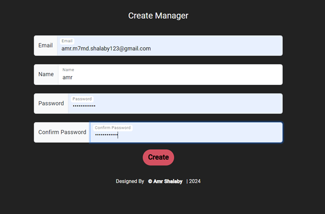

# Admin Dashboard for Bus Management System

## Project Description
This project is an Angular-based web application designed for administrators to manage a bus transportation system. The application provides functionalities to manage buses, routes, and stops, and to monitor overall system performance through a dashboard. The system allows admins to log in, view statistics, create managers, enroll bus stops, and manage other aspects of the bus transportation system.

## Features
- **Login Page**: Secure login for administrators with form validation.
- **Dashboard**: A comprehensive view of system statistics with various data visualization options.
- **Create Manager**: Form to add new managers with validation to ensure accurate data entry.
- **Enroll Bus Stops**: Interface to connect two bus stops, showing only valid connections.
- **Navigation**: Static navigation bar for easy access to all major sections of the application.
- **Logout**: Secure logout functionality to ensure system security.

## Screenshots

### Login Page


### Dashboard


### Create Manager



### Enroll Bus Stops


## Getting Started

### Prerequisites
- Node.js and npm (Node Package Manager)
- Angular CLI

### Installation

1. **Clone the repository**:
    ```sh
    git clone https://github.com/amr1234567/Transportation.System_Admin_Frontend_Angular.git
    ```

2. **Install NPM packages**:
    ```sh
    npm install
    ```

3. **Run the application**:
    ```sh
    ng serve
    ```
   Open your browser and navigate to `http://localhost:4200/`.

## Usage

1. **Login**:
   - Enter your admin credentials to log in to the system.
   - The login button remains disabled until valid credentials are provided.

2. **Dashboard**:
   - View various statistics and data visualizations.
   - Use the navigation bar on the left to switch between different sections.

3. **Create Manager**:
   - Click on "Create Manager" in the navigation bar.
   - Fill out the form with valid input to enable the "Create" button.
   - Submit the form to add a new manager.

4. **Enroll Bus Stops**:
   - Click on "Enroll" in the navigation bar.
   - Select a start bus stop to see available destination stops.
   - Choose a destination bus stop to enable the "Enroll" button.
   - Click "Enroll" to connect the two bus stops.

## Code Structure

- `src/` - Contains the Angular application components, services, and models.
- `src/assets/` - Contains static assets like images and styles.

## Contributing

1. **Fork the repository**.
2. **Create a new branch**:
    ```sh
    git checkout -b feature/YourFeature
    ```
3. **Make your changes** and commit them:
    ```sh
    git commit -m 'Add some feature'
    ```
4. **Push to the branch**:
    ```sh
    git push origin feature/YourFeature
    ```
5. **Create a new Pull Request**.

## Contact
Your Name - [your-email@example.com](amr.m7md.shalaby@gmail.com)

All Project Link: [https://github.com/amr1234567/Transportation.Managment.System.git](https://github.com/amr1234567/Transportation.Managment.System.git)

## Acknowledgments
- Special thanks to the Angular community for the resources and support.
- Thanks to all contributors who helped improve this project.
